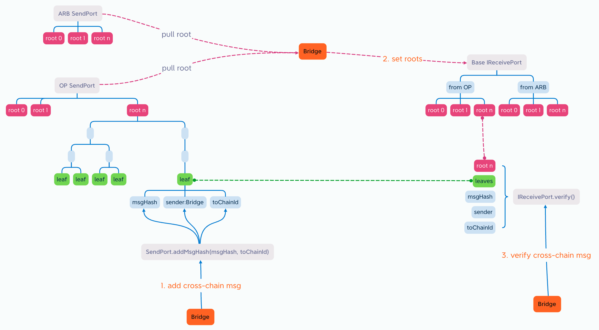
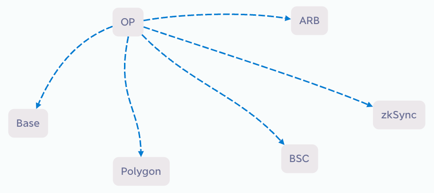
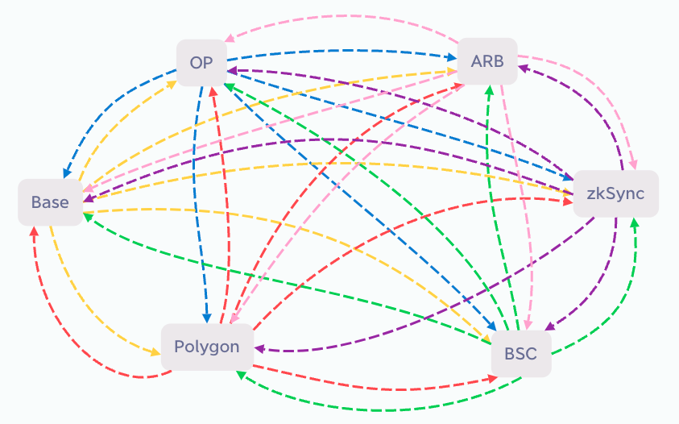
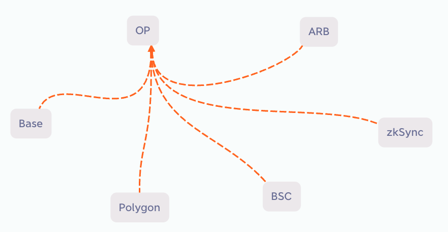

## Abstract

Public Cross Port(简称PCP)的目标是把各个EVM公链安全高效的互联起来，大幅减少跨链桥的数量和gas消耗，大幅提升安全性，推动所有EVM公链联合一起，建立一个强大的、去中心化的EVM跨链网络。为实现这一目标，需要各个跨链桥项目方使用统一的SendPort合约和IReceivePort接口。当越来越多的跨链桥项目方建立在PCP之上，整体的安全性也越高，建立去中心化的EVM跨链网络成为可能，使用这个跨链网络的Dapp将获得安全性极高的、免费的跨链服务。

## Motivation

当前L2到L1有官方跨链桥，但是L2到L2没有，如果10个L2之间要互相跨链的话，需要10 x 9 = 90个跨链桥，如果用拉取的方式，把其他9条链上的消息合并为一个tx同步到自己的链上，那么将只需要10个跨链桥，大大减少跨链桥数量和gas消耗。

这个实现如果有多个跨链桥项目方参与，将能带来安全性的大幅提升。当前的跨链桥重复建设的不少，但这种重复建设并不能带来安全的提升。如果使用统一的SendPort合约，重复的跨链桥搬运的是同样的跨链消息，那么在目标链IReceivePort验证的时候，应该得到一样的结果，这个结果由多家跨链桥项目方确认，其安全性比只有一家确认要高许多。该EIP的提出就是希望有更多的跨链桥项目方参与进来，把重复建设转换为安全性提升。

为了吸引跨链桥项目方参与进来，除了让项目方节省跨链桥数量和gas消耗，还通过Hash MerkleTree(简称MerkleTree)数据结构，使得SendPort里跨链消息的增加，并不会增加跨链桥的开销，跨链桥搬运的只需一个体积很小的root即可，进一步节省gas。

## Specification

The key words "MUST", "MUST NOT", "REQUIRED", "SHALL", "SHALL NOT", "SHOULD", "SHOULD NOT", "RECOMMENDED", "NOT RECOMMENDED", "MAY", and "OPTIONAL" in this document are to be interpreted as described in RFC 2119 and RFC 8174.

The technical specification should describe the syntax and semantics of any new feature. The specification should be detailed enough to allow competing, interoperable implementations for any of the current Ethereum platforms (go-ethereum, parity, cpp-ethereum, ethereumj, ethereumjs, and [others](https://ethereum.org/en/developers/docs/nodes-and-clients/)).

## Rationale

跨链的本质是把源链上发生的事情告诉目标链，该过程可以拆分为3步，下图为整体的原理图：



### 1.Add cross-chain msg

SendPort合约是每条链上唯一的，用于收集该链发生的事情（即跨链消息），然后打包为MerkleTree。举个例子，Bridge合约收到了用户转入的USDT，它可以把这个消息的hash和要送达的链Id发送给SendPort合约，SendPort把这些信息加上sender地址（即Bridge合约地址）的hash作为leaf存到数组，当收集到一段时间内（可能1分钟）的leaves后，自动打包为一个MerkleTree，然后开启下一次的收集。SendPort只做收集和打包，它可以无需管理，自动运行。

调用`SendPort.addMsgHash()`的可以是不同的跨链桥项目方，也可以是任意合约，调用是无需许可的，所以也可能会有错误的或欺诈的消息，所以SendPort把sender地址也打包了，意思是该`sender`想要发送信息`msgHash`到`toChainId`链，该信息在目标链上解析出来可以防止欺诈。

### 2.Pull roots & Set roots

当新的MerkleTree打包出来后，消息搬运方（一般是跨链桥项目方）pull多条链上的root，存到每条链的IReceivePort合约。这里需要说明一下，传统的做法是用push的的方式，如下图：



如果有6条链，每条链都要push到另外5条链，需要30条跨链桥，如下图所示：



如果有N条链需要互相跨链，需要的跨链桥数量是： num = N * (N - 1)

用pull的方式可以把5条链的跨链消息合并为1个tx，从而大幅减少跨链桥，如下图：



如果每条链都把其他5条链的消息pull到自己链上，需要6条跨链桥即可，如果有N条链需要互相跨链，需要的跨链桥数量是：num = N

从而大幅减少跨链桥的数量。

MerkleTree的数据结构可以最大程度的压缩跨链消息的大小，无论有多少跨链消息，都可以压缩到一个root，即byte32的大小，消息搬运方只需要搬运root即可，gas消耗很低。

一个root包含了多家跨链桥的消息，也包含了发送到各个目标链的消息。对搬运方来说，可能root并没有跟它有关的消息，所以并不想搬运，亦或是root并没有发送到某目标链的消息，所以并不想浪费gas搬运到该目标链，这些由搬运方决定。

所以，IReceivePort合约不是唯一的，是搬运方根据IReceivePort接口自行实现的，有多家的搬运方，就有多家的IReceivePort合约。

### 3.Verify cross-chain msg

IReceivePort合约存储了各条链的roots，所以给它完整的消息，它可以验证消息的真伪。注意root不能解析出消息，只能验证消息真伪，而完整的消息，可以从源链的SendPort合约中读取出来。

因为roots都来自相同的SendPort，所以不同IReceivePort合约中的roots应该是一样的，换句话说，如果一个消息为真，在不同的IReceivePort合约中，应该都能验证为真，从而大幅提高安全性。这有点像多签的原理，如果大部分IReceivePort合约都验证为真，那么应该就是真的，而那些验证为假的，很有可能是该跨链桥被黑客攻击或宕机了。这是一种去中心化的参与方式，单点故障并不影响整体安全性，把重复建设转换为安全性提升。

## Backwards Compatibility

This EIP does not change the consensus layer, so there are no backwards compatibility issues for Ethereum as a whole. 

## Reference Implementation

```solidity
pragma solidity ^0.8.0;
```

## Security Considerations

All EIPs must contain a section that discusses the security implications/considerations relevant to the proposed change. Include information that might be important for security discussions, surfaces risks and can be used throughout the life cycle of the proposal. E.g. include security-relevant design decisions, concerns, important discussions, implementation-specific guidance and pitfalls, an outline of threats and risks and how they are being addressed. EIP submissions missing the "Security Considerations" section will be rejected. An EIP cannot proceed to status "Final" without a Security Considerations discussion deemed sufficient by the reviewers.

## Copyright

Copyright and related rights waived via [CC0](../LICENSE.md).
