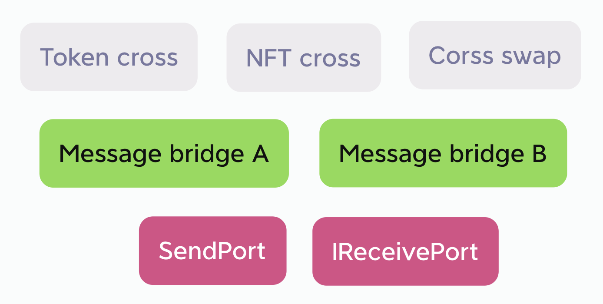

## Abstract

Public Cross Port(简称PCP)的目标是把各个EVM公链安全高效的互联起来，大幅减少跨链桥的数量和gas消耗，大幅提升安全性，推动所有EVM公链联合一起，建立一个强大的、去中心化的EVM跨链网络。为实现这一目标，需要各个跨链桥项目方使用统一的SendPort合约和IReceivePort接口。当越来越多的跨链桥项目方建立在PCP之上，整体的安全性也越高，建立去中心化的EVM跨链网络成为可能，使用这个跨链网络的Dapp将获得安全性极高的、免费的跨链服务。


## Motivation

当前L2到L1有官方跨链桥，但是L2到L2没有，如果10个L2之间要互相跨链的话，需要10 x 9 = 90个跨链桥，如果用拉取的方式，把其他9条链上的消息合并为一个tx同步到自己的链上，那么将只需要10个跨链桥，大大减少跨链桥数量和gas消耗。

这个实现如果有多个跨链桥项目方参与，将能带来安全性的大幅提升。当前的跨链桥重复建设的不少，但这种重复建设并不能带来安全的提升。如果使用统一的SendPort合约，重复的跨链桥搬运的是同样的跨链消息，那么在目标链IReceivePort验证的时候，应该得到一样的结果，这个结果由多家跨链桥项目方确认，其安全性比只有一家确认要高许多。该EIP的提出就是希望有更多的跨链桥项目方参与进来，把重复建设转换为安全性提升。

为了吸引跨链桥项目方参与进来，除了让项目方节省跨链桥数量和gas消耗，还通过Hash MerkleTree(简称MerkleTree)数据结构，使得SendPort里跨链消息的增加，并不会增加跨链桥的开销，跨链桥搬运的只需一个体积很小的root即可，进一步节省gas。


### Use case

本EIP将跨链生态分为三层，并定义了基础层的SendPort合约和IReceivePort接口，其他则由生态项目方自行实现。



本EIP官方在每条链上部署唯一的SendPort合约，用于收集该链上的跨链消息并打包，SendPort是公共的、无需使用许可、无管理员并自动运行的。消息跨链桥从SendPort获取跨链信息，搬运到目标链上即完成消息跨链。

消息跨链之上可以进行Token跨链、NFT跨链、跨链交易等各类跨链应用。

消息跨链桥可以和Token跨链合二为一，后面有代码示例。也可以分开，以NFT cross应用为例，该应用可以没有自己的跨链桥，它可以复用Token的消息跨链桥，还可以复用多个消息跨链桥，复用多个桥来验证消息可以大幅提升安全性，且不需要为跨链和验证服务付费。


## Specification

The key words "MUST", "MUST NOT", "REQUIRED", "SHALL", "SHALL NOT", "SHOULD", "SHOULD NOT", "RECOMMENDED", "NOT RECOMMENDED", "MAY", and "OPTIONAL" in this document are to be interpreted as described in RFC 2119 and RFC 8174.

### `ISendPort` Interface and `SendPort` Implementation

```solidity
pragma solidity ^0.8.0;

interface ISendPort {
    event MsgHashAdded(uint indexed packageIndex, address sender, bytes32 msgHash, uint toChainId, bytes32 leaf);

    event Packed(uint indexed packageIndex, uint indexed packTime, bytes32 root);

    struct Package {
        uint packageIndex;
        bytes32 root;
        bytes32[] leaves;
        uint createTime;
        uint packTime;
    }

    function addMsgHash(bytes32 msgHash, uint toChainId) external;

    function pack() external;

    function getPackage(uint packageIndex) external view returns (Package memory);

    function getPendingPackage() external view returns (Package memory);
}
```

Let:
- `Package` 收集一段时间内的跨链消息，打包为一个`Package`
  - `packageIndex` `Package`的序号，从0开始
  - `root` 把`leaves`按MerkleTree生成的root，即打包
  - `leaves` 每一个leaf是一个跨链消息，leaf是`msgHash`, `sender`, `toChainId`计算出的hash
    - `msgHash` 消息hash，从外部合约传入
    - `sender` 即外部合约地址，无需传入
    - `toChainId` 要发送到哪条链，从外部合约传入
  - `createTime` 该`Package`开始收集的时间戳，也是上一个`Package`打包的时间戳
  - `packTime` 该`Package`打包的时间戳，打包即生成`root`，并不再接收leaf
- `addMsgHash` 外部合约把跨链消息发给SendPort
- `pack` 手动打包，通常是最后一个提交消息的自动触发打包，如果等了很久也没有等到最后一个提交者，那么可以手动打包
- `getPackage` 查询SendPort的每个Package，包括已打包的和pendingPackage
- `getPendingPackage` 查询SendPort的pendingPackage

```solidity
pragma solidity ^0.8.0;

import "./ISendPort.sol";

contract SendPort is ISendPort {
    uint public constant PACK_INTERVAL = 6000;
    uint public constant MAX_PACKAGE_MESSAGES = 100;

    uint public pendingIndex = 0;

    mapping(uint => Package) public packages;

    constructor() {
        packages[0] = Package(0, bytes32(0), new bytes32[](0), block.timestamp, 0);
    }

    function addMsgHash(bytes32 msgHash, uint toChainId) public {
        bytes32 leaf = keccak256(
            abi.encodePacked(msgHash, msg.sender, toChainId)
        );
        Package storage pendingPackage = packages[pendingIndex];
        pendingPackage.leaves.push(leaf);

        emit MsgHashAdded(pendingPackage.packageIndex, msg.sender, msgHash, toChainId, leaf);

        if (pendingPackage.leaves.length >= MAX_PACKAGE_MESSAGES) {
            console.log("MAX_PACKAGE_MESSAGES", pendingPackage.leaves.length);
            _pack();
            return;
        }

        // console.log("block.timestamp", block.timestamp);
        if (pendingPackage.createTime + PACK_INTERVAL <= block.timestamp) {
            console.log("PACK_INTERVAL", pendingPackage.createTime, block.timestamp);
            _pack();
        }
    }

    function pack() public {
        require(packages[pendingIndex].createTime + PACK_INTERVAL <= block.timestamp, "SendPort::pack: pack interval too short");

       _pack();
    }

    function getPackage(uint packageIndex) public view returns (Package memory) {
        return packages[packageIndex];
    }

    function getPendingPackage() public view returns (Package memory) {
        return packages[pendingIndex];
    }

    function _pack() internal {
        Package storage pendingPackage = packages[pendingIndex];
        bytes32[] memory _leaves = pendingPackage.leaves;
        while (_leaves.length > 1) {
            _leaves = _computeLeaves(_leaves);
        }
        pendingPackage.root = _leaves[0];
        pendingPackage.packTime = block.timestamp;

        emit Packed(pendingPackage.packageIndex, pendingPackage.packTime, pendingPackage.root);

        pendingIndex = pendingPackage.packageIndex + 1;
        packages[pendingIndex] = Package(pendingIndex, bytes32(0), new bytes32[](0), pendingPackage.packTime, 0);
    }

    function _computeLeaves(bytes32[] memory _leaves) pure internal returns (bytes32[] memory _nextLeaves) {
        if (_leaves.length % 2 == 0) {
            _nextLeaves = new bytes32[](_leaves.length / 2);
            bytes32 computedHash;
            for (uint i = 0; i + 1 < _leaves.length; i += 2) {
                computedHash = _hashPair(_leaves[i], _leaves[i + 1]);
                _nextLeaves[i / 2] = computedHash;
            }

        } else {
            bytes32 lastLeaf = _leaves[_leaves.length - 1];
            _nextLeaves = new bytes32[]((_leaves.length / 2 + 1));
            bytes32 computedHash;
            for (uint i = 0; i + 1 < _leaves.length; i += 2) {
                computedHash = _hashPair(_leaves[i], _leaves[i + 1]);
                _nextLeaves[i / 2] = computedHash;
            }
            _nextLeaves[_nextLeaves.length - 1] = lastLeaf;
        }
    }

    function _hashPair(bytes32 a, bytes32 b) private pure returns (bytes32) {
        return a < b ? _efficientHash(a, b) : _efficientHash(b, a);
    }

    function _efficientHash(bytes32 a, bytes32 b) private pure returns (bytes32 value) {
        /// @solidity memory-safe-assembly
        assembly {
            mstore(0x00, a)
            mstore(0x20, b)
            value := keccak256(0x00, 0x40)
        }
    }
}
```

External featrues:

- `PACK_INTERVAL` 两次打包的最小时间间隔，超过这个时间便可以打包
- `MAX_PACKAGE_MESSAGES` 收集到`MAX_PACKAGE_MESSAGES`个消息后立即打包，优先级高于`PACK_INTERVAL`

### `IReceivePort` Interface

```solidity
pragma solidity ^0.8.0;

interface IReceivePort {
    event PackageReceived(uint indexed fromChainId, uint indexed packageIndex, bytes32 root);

    struct Package {
        uint fromChainId;
        uint packageIndex;
        bytes32 root;
    }

    function receivePackages(Package[] calldata packages) external;

    function getRoot(uint fromChainId, uint packageIndex) external view returns (bytes32);

    function verify(
        uint fromChainId,
        uint packageIndex,
        bytes32[] memory proof,
        bytes32 msgHash,
        address sender
    ) external view returns (bool);
}
```

Let:
- `Package` 收集一段时间内的跨链消息，打包为一个`Package`
  - `fromChainId` 该`Package`从哪条链过来
  - `packageIndex` `Package`的序号，从0开始
  - `root` 把`leaves`按MerkleTree生成的root，即打包
- `receivePackages` 把多个源链上的`root`一起搬运到目标链上
- `getRoot` 查询某个链上的某个root
- `verify` 验证源链上的消息是否为sender发送


## Rationale

跨链的本质是把源链上发生的事情告诉目标链，该过程可以拆分为3步，下图为整体的原理图：


### 1.Add cross-chain msg

SendPort合约是每条链上唯一的，用于收集该链发生的事情（即跨链消息），然后打包为MerkleTree。举个例子，Bridge合约收到了用户转入的USDT，它可以把这个消息的hash和要送达的链Id发送给SendPort合约，SendPort把这些信息加上sender地址（即Bridge合约地址）的hash作为leaf存到数组，当收集到一段时间内（可能1分钟）的leaves后，自动打包为一个MerkleTree，然后开启下一次的收集。SendPort只做收集和打包，它可以无需管理，自动运行。

调用`SendPort.addMsgHash()`的可以是不同的跨链桥项目方，也可以是任意合约，调用是无需许可的，所以也可能会有错误的或欺诈的消息，所以SendPort把sender地址也打包了，意思是该`sender`想要发送信息`msgHash`到`toChainId`链，该信息在目标链上解析出来可以防止欺诈。

### 2.Pull roots & Set roots

当新的MerkleTree打包出来后，消息搬运方（一般是跨链桥项目方）pull多条链上的root，存到每条链的IReceivePort合约。这里需要说明一下，传统的做法是用push的的方式，如下图：


如果有6条链，每条链都要push到另外5条链，需要30条跨链桥，如下图所示：


如果有N条链需要互相跨链，需要的跨链桥数量是： num = N * (N - 1)

用pull的方式可以把5条链的跨链消息合并为1个tx，从而大幅减少跨链桥，如下图：


如果每条链都把其他5条链的消息pull到自己链上，需要6条跨链桥即可，如果有N条链需要互相跨链，需要的跨链桥数量是：num = N

所以pull的方式能够大幅减少跨链桥的数量。

MerkleTree的数据结构可以最大程度的压缩跨链消息的大小，无论有多少跨链消息，都可以压缩到一个root，即byte32的大小，消息搬运方只需要搬运root即可，gas消耗很低。

一个root包含了多家跨链桥的消息，也包含了发送到各个目标链的消息。对搬运方来说，可能root并没有跟它有关的消息，所以并不想搬运，亦或是root并没有发送到某目标链的消息，所以并不想浪费gas搬运到该目标链，这些由搬运方决定。

所以，IReceivePort合约不是唯一的，是搬运方根据IReceivePort接口自行实现的，有多家的搬运方，就有多家的IReceivePort合约。

### 3.Verify cross-chain msg

IReceivePort合约存储了各条链的roots，所以给它完整的消息，它可以验证消息的真伪。注意root不能解析出消息，只能验证消息真伪，而完整的消息，可以从源链的SendPort合约中读取出来。

因为roots都来自相同的SendPort，所以不同IReceivePort合约中的roots应该是一样的，换句话说，如果一个消息为真，在不同的IReceivePort合约中，应该都能验证为真，从而大幅提高安全性。这有点像多签的原理，如果大部分IReceivePort合约都验证为真，那么应该就是真的，而那些验证为假的，很有可能是该跨链桥被黑客攻击或宕机了。这是一种去中心化的参与方式，单点故障并不影响整体安全性，把重复建设转换为安全性提升。

## Backwards Compatibility

This EIP does not change the consensus layer, so there are no backwards compatibility issues for Ethereum as a whole. 

## Reference Implementation

以下是跨链桥的示例合约
ReceivePort.sol (for example)
```solidity
pragma solidity ^0.8.0;

import "./IReceivePort.sol";

abstract contract ReceivePort is IReceivePort {

    //fromChainId => packageIndex => root
    mapping(uint => mapping(uint => bytes32)) public roots;

    constructor() {}

    function receivePackages(Package[] calldata packages) public {
        for (uint i = 0; i < packages.length; i++) {
            Package calldata p = packages[i];
            require(roots[p.fromChainId][p.packageIndex] == bytes32(0), "ReceivePort::receivePackages: package already exist");
            roots[p.fromChainId][p.packageIndex] = p.root;

            emit PackageReceived(p.fromChainId, p.packageIndex, p.root);
        }
    }

    function getRoot(uint fromChainId, uint packageIndex) public view returns (bytes32) {
        return roots[fromChainId][packageIndex];
    }

    function verify(
        uint fromChainId,
        uint packageIndex,
        bytes32[] memory proof,
        bytes32 msgHash,
        address sender
    ) public view returns (bool) {
        bytes32 leaf = keccak256(
            abi.encodePacked(msgHash, sender, block.chainid)
        );
        return _processProof(proof, leaf) == roots[fromChainId][packageIndex];
    }

    function _processProof(bytes32[] memory proof, bytes32 leaf) internal pure returns (bytes32) {
        bytes32 computedHash = leaf;
        for (uint256 i = 0; i < proof.length; i++) {
            computedHash = _hashPair(computedHash, proof[i]);
        }
        return computedHash;
    }

    function _hashPair(bytes32 a, bytes32 b) private pure returns (bytes32) {
        return a < b ? _efficientHash(a, b) : _efficientHash(b, a);
    }

    function _efficientHash(bytes32 a, bytes32 b) private pure returns (bytes32 value) {
        /// @solidity memory-safe-assembly
        assembly {
            mstore(0x00, a)
            mstore(0x20, b)
            value := keccak256(0x00, 0x40)
        }
    }
}
```

BridgeExample.sol (for example)
```solidity
pragma solidity ^0.8.0;

import "@openzeppelin/contracts/token/ERC20/IERC20.sol";
import "@openzeppelin/contracts/token/ERC20/utils/SafeERC20.sol";
import "@openzeppelin/contracts/access/Ownable.sol";
import "./ISendPort.sol";
import "./ReceivePort.sol";

contract BridgeExample is ReceivePort, Ownable {
    using SafeERC20 for IERC20;

    ISendPort public sendPort;

    mapping(bytes32 => bool) public usedMsgHashes;

    mapping(uint => address) public trustBridges;

    mapping(address => address) public crossPairs;

    constructor(address sendPortAddr) {
        sendPort = ISendPort(sendPortAddr);
    }

    function setTrustBridge(uint chainId, address bridge) public onlyOwner {
        trustBridges[chainId] = bridge;
    }

    function setCrossPair(address fromTokenAddr, address toTokenAddr) public onlyOwner {
        crossPairs[fromTokenAddr] = toTokenAddr;
    }

    function getLeaves(uint packageIndex, uint start, uint num) view public returns(bytes32[] memory) {
        ISendPort.Package memory p = sendPort.getPackage(packageIndex);
        bytes32[] memory result = new bytes32[](num);
        for (uint i = 0; i < p.leaves.length && i < num; i++) {
            result[i] = p.leaves[i + start];
        }
        return result;
    }

    function transferTo(
        uint toChainId,
        address fromTokenAddr,
        uint amount,
        address receiver
    ) public {
        bytes32 msgHash = keccak256(
            abi.encodePacked(toChainId, fromTokenAddr, amount, receiver)
        );
        sendPort.addMsgHash(msgHash, toChainId);

        IERC20(fromTokenAddr).safeTransferFrom(msg.sender, address(this), amount);
    }

    function transferFrom(
        uint fromChainId,
        uint packageIndex,
        bytes32[] memory proof,
        address fromTokenAddr,
        uint amount,
        address receiver
    ) public {
        bytes32 msgHash = keccak256(
            abi.encodePacked(block.chainid, fromTokenAddr, amount, receiver)
        );

        require(!usedMsgHashes[msgHash], "transferFrom: Used msgHash");

        require(
            verify(
                fromChainId,
                packageIndex,
                proof,
                msgHash,
                trustBridges[fromChainId]
            ),
            "transferFrom: verify failed"
        );

        usedMsgHashes[msgHash] = true;

        address toTokenAddr = crossPairs[fromTokenAddr];
        require(toTokenAddr != address(0), "transferFrom: fromTokenAddr is not crossPair");
        IERC20(toTokenAddr).safeTransfer(receiver, amount);
    }
}
```

## Security Considerations

关于跨链桥之间的竞争和双花：

SendPort只做一件事情，把要跨链的消息进行统一打包。消息的传输和验证交给各个跨链桥项目方自行实现，目的是要确保不同的跨链桥在源链上获取的跨链消息是一致的，所以跨链桥之间不需要竞争root的搬运权或验证权，各自都是独立运行。如果跨链桥自己的方案实现有bug的话，对他们自己有风险，但风险不会扩散到其他跨链桥。RECOMMENDED：
1. 跨链桥自己搬运root，不要让其他搬运方把root搬运到自己的IReceivePort。
2. 验证的时候把验证通过的leaf存起来，避免下次再验证造成双花。
3. 不要信任MerkleTree里的所有sender。

关于伪造跨链消息：

由于SendPort是公共合约，没有使用限制，任何人都可以往SendPort发送任意的跨链消息，所以SendPort会把msg.sender一起打包，如果黑客想要伪造跨链消息，SendPort也会把黑客的地址加上伪造的消息一起打包，在验证的时候黑客地址就会被验证出来。这也是建议的第3点：不要信任MerkleTree里的所有sender。

关于消息的排序：

虽然SendPort把收到的跨链消息按时间排序，但是验证的时候不保证顺序。假如用户先跨链了10ETH，然后又跨链了20USDT，但是在目标链，他可能会先取出20USDT，再取出10ETH，或者等很久再取。具体要看IReceivePort的实现方式。

关于数据完整性：

SendPort有全部的roots以及连续的index序号，不会删除和更改，各跨链桥的IReceivePort也应该如此。

## Copyright

Copyright and related rights waived via [CC0](../LICENSE.md).
